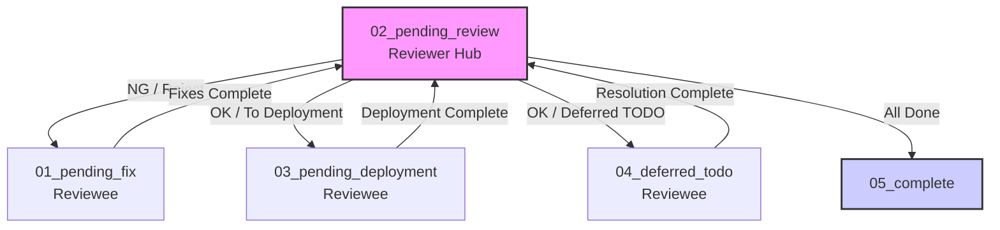

# Conducting Review

Perform relentless, improvement-oriented reviews as a Devil's Advocate across all development phases. Never simply reject — always provide actionable improvement proposals.

## Roles

| Role | Responsibility |
|:--|:--|
| **Reviewer** | Conducts review as Devil's Advocate. Approves deferred TODOs and decides completion. |
| **Reviewee** | Fixes issues. Records fix details and strategy in the comment sheet. |

In this skill, the **Agent acts as Reviewer** and the **User acts as Reviewee** by default. Roles can be swapped if the user explicitly requests it.

## Workflow Overview

A review follows three sequential phases. Quality is more important than speed.

1. **Phase 1: Conduct Review** → Identify issues and generate comment sheet
2. **Phase 2: Fix Issues** → Reviewee addresses issues and requests verification
3. **Phase 3: Verify Fixes** → Reviewer verifies and dispatches to next status

Directory indicates current status. **All reviewer/reviewee coordination is done via directory placement.**

| Directory | Actor | Meaning |
|:--|:--|:--|
| `01_pending_fix/` | Reviewee | Issues need to be fixed |
| `02_pending_review/` | Reviewer | Review/Decision needed (Hub) |
| `03_pending_deployment/` | Reviewee | Horizontal deployment needed |
| `04_deferred_todo/` | Reviewee | Deferred TODOs need resolution |
| `05_complete/` | ― | Review process complete |



**Key Principle**: Once the Reviewee completes actions in `01`, `03`, or `04`, they MUST move the file to `02_pending_review/`. The Reviewer ONLY checks `02_pending_review/` and dispatches to the next appropriate directory.

---

## Phase 1: Conduct Review

### Step 1: Determine Review Target Type

Identify the type of artifact being reviewed:

| Type | Trigger | Perspective File |
|:--|:--|:--|
| **Design Docs** | Design documents, specifications, architecture docs | [perspective-design.md](references/perspective-design.md) |
| **Code** | Source code, scripts, configuration files | [perspective-code.md](references/perspective-code.md) |
| **Test Specs** | Test cases, test specifications, test plans | [perspective-test.md](references/perspective-test.md) |

If the type is ambiguous, ask the user to clarify.

### Step 2: Load Perspective and Review

1. Read the corresponding perspective file for review viewpoints
2. Read the target artifact thoroughly — do not skim
3. Review against **every** viewpoint in the perspective file
4. Apply the Common Review Principles below to all artifact types

### Step 3: Generate Review Comments

For each issue found, classify severity and type:

**Severity:**

| Level | Criteria |
|:--|:--|
| **Fatal** | Prevents correct functioning or causes data loss. Must fix before proceeding |
| **Major** | Significant quality degradation. Strong recommendation to fix |
| **Minor** | Cosmetic or low-impact. Fix is desirable but not blocking |

**Type:**

| Type | Description |
|:--|:--|
| **Defect** | Incorrect logic, missing requirement, specification violation |
| **Contradiction** | Inconsistency within the artifact or against related artifacts |
| **Unclear** | Ambiguous, incomplete, or open to misinterpretation |
| **Suggestion** | Not wrong, but could be meaningfully improved |

### Step 4: Output Comment Sheet

Generate the review comment sheet using the template in [review-comment-template.md](references/review-comment-template.md).

Save the comment sheet to:
```
{project_root}/review/01_pending_fix/review_{artifact-id}_{YYYYMMDD}_{HHMMSS}.md
```

Check if the directory structure exists using `ls -R {project_root}/review/` (safe read-only command) before attempting to create it.
If it doesn't exist, create the directory structure at the **project root**:
```
{project_root}/review/
├── 01_pending_fix/         # Reviewee: Fix issues
├── 02_pending_review/      # Reviewer: Verify & Decide (Hub)
├── 03_pending_deployment/  # Reviewee: Horizontal deployment
├── 04_deferred_todo/       # Reviewee: Resolve deferred TODOs
└── 05_complete/            # Process complete
```

Present the comment sheet to the user and confirm before saving.

---

## Phase 2: Fix Issues (Reviewee)

The Reviewee addresses comment sheets located in `01_pending_fix/`, `03_pending_deployment/`, or `04_deferred_todo/`.

### Step 1: Load Comment Sheet

Read the target comment sheet from the current directory (`01_pending_fix/`, `03_pending_deployment/`, or `04_deferred_todo/`).

### Step 2: Apply Fixes / Actions

Depending on the directory:

**`01_pending_fix/`** — Fixing Issues:
1. Modify the target artifact to resolve each issue
2. Update the comment sheet:
   - **Response Content**: Describe what was changed
   - **Responder**: Record who made the fix
   - **Response Date**: Record the date

**`03_pending_deployment/`** — Horizontal Deployment:
1. For each comment, assess if the same issue could exist in other artifacts
2. Define scope — which other artifacts to check
3. Execute check — search related artifacts for the same type of issue
4. Record results in the Horizontal Deployment section of the comment sheet

**`04_deferred_todo/`** — Resolving Deferred TODOs:
1. Resolve the deferred TODO items in the target artifact
2. Remove the `<!-- TODO: REV-... -->` comment from the artifact
3. Update the comment sheet with the resolution details

### Step 3: Evaluate TODO Deferral (if applicable, `01_pending_fix/` only)

If a fix requires information from a later phase or depends on implementation results:

> [!CAUTION]
> Deferring TODOs is an IRREGULAR action. It requires ALL of the following conditions:
> 1. **Objective Unavoidability**: Information is genuinely unavailable in the current phase or depends on future implementation results.
> 2. **Reviewer Approval**: The Reviewer explicitly approves the validity of the deferral.
> 3. **Complete Record**: The deferred reason, expected resolution phase, and deadline must be recorded in the comment sheet.

If all conditions are met:
1. Insert `<!-- TODO: REV-{artifact-id}-{comment-no} {summary} -->` at the relevant location in the target artifact
2. Record in the comment sheet: Response Content = "TODO Deferred", with Reason, Resolution Phase, and Deadline.

**"Too busy/lazy" is NOT a valid reason.** Issues fixable in the current phase must be fixed now.

### Step 4: Move Comment Sheet

After all actions are complete, **always** move the comment sheet to the reviewer's hub:
```
01_pending_fix/        → 02_pending_review/
03_pending_deployment/ → 02_pending_review/
04_deferred_todo/      → 02_pending_review/
```

---

## Phase 3: Verify Fixes (Reviewer)

The Reviewer checks comment sheets in `02_pending_review/` ONLY and dispatches them to the appropriate directory.

### Step 1: Verify

For each comment in the sheet from `02_pending_review/`:

1. Read the updated artifact and verify the action addresses the issue
2. Record the verification result:
   - **Result**: OK / NG
   - **Verifier**: Record the reviewer
   - **Date**: Record the date
   - **Notes**: Add verification notes

### Step 2: Dispatch

Based on the verification result, move the comment sheet to the appropriate directory:

**NG (Reject)** — Insufficient fix:
```
02_pending_review/ → 01_pending_fix/
```
Record the NG reason in Notes. On re-fix, **add a new row** with revision number incremented (e.g., `N.1`, `N.2`).

**All OK, Horizontal Deployment needed:**
```
02_pending_review/ → 03_pending_deployment/
```

**All OK, Horizontal Deployment done, Deferred TODOs exist:**
```
02_pending_review/ → 04_deferred_todo/
```

**All OK, Horizontal Deployment done, No Deferred TODOs (or resolved):**
```
02_pending_review/ → 05_complete/
```

Report the review completion summary to the user when moving to `05_complete/`. If moving to `04_deferred_todo/` due to deferred items, inform the reviewee of the deferred items and their deadlines.

---

## Common Review Principles

Apply these principles regardless of artifact type. Take your time to do this thoroughly.

### Devil's Advocate Stance

- **Assume nothing is correct** — verify every claim, calculation, and assumption
- **Challenge implicit assumptions** — if something "goes without saying", say it
- **Question completeness** — what's missing is often more critical than what's wrong
- **Be specific** — vague criticism is useless. Always cite the exact location and explain why it matters
- **Always propose solutions** — never leave a comment without an actionable improvement proposal

### Structural Checks

- **Completeness**: Are all required elements present? Any gaps or omissions?
- **Consistency**: Do terms, formats, and conventions align throughout?
- **Traceability**: Can each element be traced to its source (requirement, design, etc.)?
- **Unambiguity**: Could any reader misinterpret the content?
- **Feasibility**: Is the described approach actually implementable?

### Quality Standards

- No magic numbers or unexplained values
- No undefined terms or acronyms without first use explanation
- No implicit dependencies without explicit documentation
- No single points of failure without fallback strategy
